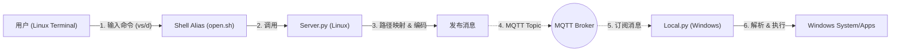

# FastOpen

**FastOpen** 是一个高效的跨平台开发辅助工具，旨在打通 Linux 服务器与 Windows 本地开发环境的边界。

它允许你在 Linux 终端（SSH）中直接输入命令，自动触发 Windows 端的操作。例如：在 Linux 终端输入 `vs main.py`，即可唤起 Windows 上的 VS Code 打开该文件，或者输入 `d .` 在 Windows 资源管理器中打开当前 Linux 目录。

---

## 🏗️ 项目架构

FastOpen 采用 **客户端-服务器 (C/S)** 架构，通过 **MQTT 协议** 进行解耦通信，实现 Linux 与 Windows 的跨平台互操作。



1.  **Server 端 (Linux)**: 接收用户指令，根据 `config.json` 将 Linux 路径转换为 Windows 路径（支持 UNC 或盘符），打包成 JSON 消息发送到 MQTT。
2.  **MQTT Broker**: 作为消息中转站（需确保两端均可访问）。
3.  **Local 端 (Windows)**: 持续监听 MQTT 消息，解析指令并调用 Windows API 或 CMD 执行操作（如打开 VS Code、资源管理器）。

---

## 🔥 主要功能

- **无缝打开文件/目录**：在 Linux 终端操作，Windows 端实时响应。
- **智能路径映射**：
    - 支持 **网络路径 (UNC)**：`\\IP\path`（零配置，自动推导）。
    - 支持 **磁盘映射 (Drive)**：`Z:\path`（支持手动挂载的盘符）。
    - 自动处理 Linux (`/`) 与 Windows (`\`) 的路径分隔符转换。
- **命令转发**：支持自定义命令，如用 VS Code 打开 (`code`)、资源管理器打开 (`start`) 等。
- **ADB 指令增强**：智能识别 `adb push` 目标路径（自动推断 Android 分区结构）。
- **极简配置**：默认情况下只需配置 IP，即可开箱即用。

---

## 🛠️ 安装与配置

### 1. 准备工作
- **Linux 端**：Python 3
- **Windows 端**：Python 3
- **文件共享**：确保 Windows 能通过网络访问 Linux 文件（如 Samba 共享）。

### 2. 配置文件 (`config.json`)
请在项目根目录修改 `config.json`。支持两种配置模式：

#### 模式 A：自动检测 (推荐 - 最小配置)
无需手动映射盘符，系统会将 Linux 路径转换为 Windows UNC 网络路径 (`\\IP\User\...`)。
```json
{
    "MQTT config": {
        "Server": "10.17.100.247",
        "Port": "1883",
        "KeepAliveSeconed": "10",
        "Topic": "fastopen"
    },
    "server config": [
        {
            "IP": "10.17.100.247",
            "server": "",
            "local": ""
        }
    ],
    "command": [
        {
            "name": "vs",
            "execute": "code {file}"
        },
        {
            "name": "d",
            "execute": "start {file}"
        }
    ]
}
```

#### 模式 B：手动挂载 (盘符映射)
如果你将 Linux 目录挂载为了 Windows 盘符 (如 `Z:` 对应 `/home/quwj/`)：
```json
{
    "server config": [
        {
            "IP": "",
            "server": "/home/quwj/",
            "local": "Z:/"
        }
    ]
}
```

---

### 3. 服务端部署 (Linux)

**步骤 1：生成执行脚本**
在 Linux 终端运行以下命令，根据配置自动生成 `open.sh`：
```bash
python3 server.py -c ServerInstall
```

**步骤 2：配置 Alias**
为了方便使用，将别名添加到你的 shell 配置文件 (`~/.bashrc` 或 `~/.zshrc`)。

方法一 (推荐)：直接配置到的 `alias.bashrc`
```bash
source /path/to/fastopen/alias.bashrc
```

方法二：手动添加 Alias
```bash
alias vs='/path/to/fastopen/open.sh vs '
alias d='/path/to/fastopen/open.sh d '
```
*别忘了执行 `source ~/.bashrc` 使配置生效。*

---

### 4. 客户端部署 (Windows)

在 Windows 上运行监听程序，保持窗口开启：
```cmd
cd path/to/fastopen
python local.py
```
*建议将其加入开机自启或使用后台工具运行。*

---

## 🚀 使用指南

| 命令 | 示例 | 作用 |
| :--- | :--- | :--- |
| **vs** | `vs main.py` | 用 VS Code 打开当前文件 |
| | `vs .` | 用 VS Code 打开当前项目目录 |
| | `vs ~/config` | 打开 Home 目录下的文件 |
| **d** | `d .` | 在 Windows 资源管理器中打开当前目录 |
| **adb**| `adb push file` | (特殊) 自动推断 Android 目标路径并 Push |

---

## ❓ 常见问题

**Q1: 执行 `vs .` 打开的路径不对？**
- 检查 `config.json` 中的 `IP` 是否填写正确。
- 如果使用了盘符映射，请确保 `config.json` 中的 `server` 和 `local` 路径完全对应且以 `/` 结尾。

**Q2: 没有任何反应？**
- 检查 `config.json` 中的 MQTT Broker IP 是否正确。
- 确保 Windows 端的 `local.py` 正在运行且已连接 MQTT (`Connected to MQTT OK`).
- 确保 Linux 和 Windows 能 ping 通 MQTT 服务器。

**Q3: 路径包含中文或空格？**
- FastOpen 已做处理，但建议路径尽量避免特殊字符。

---
